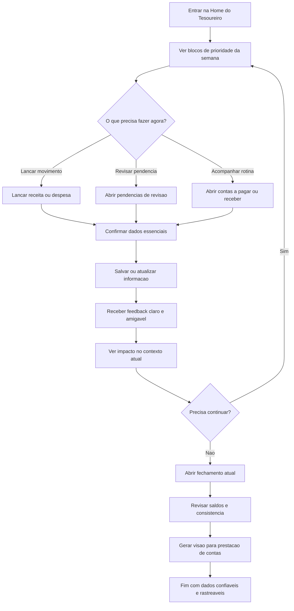
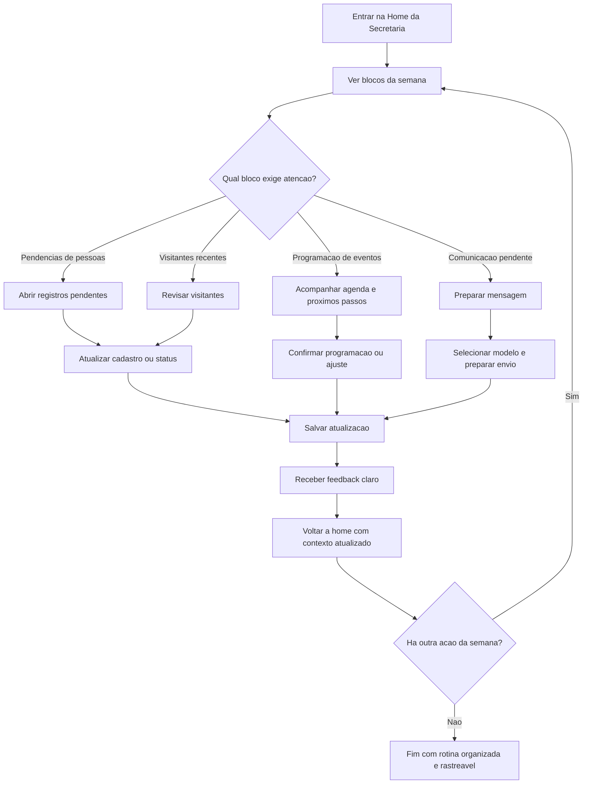
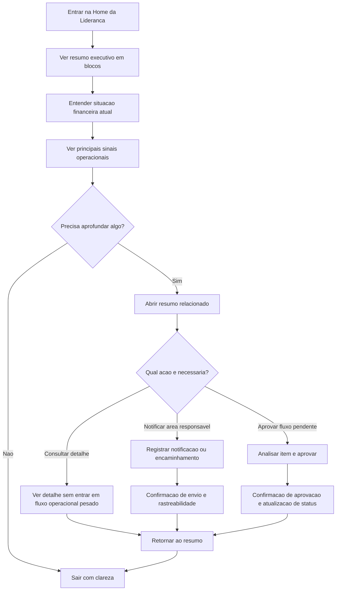

# UX Design Specification curso-bmad

**Author:** Wesley Silva
**Date:** 2026-04-13

---

<!-- UX design content will be appended sequentially through collaborative workflow steps -->

## Executive Summary

### Project Vision

`curso-bmad` deve ser um ERP eclesiastico que parece apoio operacional real, nao software corporativo deslocado. O MVP precisa gerar valor visivel logo na primeira semana, com foco em rotinas financeiras, base de pessoas, pendencias por perfil e preparacao de comunicacao, sempre transmitindo clareza, seguranca e adequacao cultural.

### Target Users

Os usuarios primarios sao tesoureiro e secretario(a)/administrador(a), com necessidades operacionais frequentes e pouco espaco para burocracia. O usuario secundario e a lideranca, que precisa de visibilidade simples e confiavel sem entrar na sobrecarga dos fluxos operacionais.

### Key Design Challenges

- Transformar o produto em ambiente de trabalho por papel, e nao em menu generico de modulos
- Fazer fluxos sensiveis, especialmente financeiros, parecerem seguros, claros e reversiveis
- Construir linguagem visual e textual pastoral e operacional, evitando tom empresarial ou controlador

### Design Opportunities

- Criar uma home do tesoureiro centrada em fechamento, acao imediata e prestacao de contas
- Estruturar a home da secretaria como fila operacional viva, com continuidade semanal
- Entregar uma experiencia de lideranca baseada em leitura rapida, clareza e baixa carga cognitiva

## Core User Experience

### Defining Experience

A experiencia central de `curso-bmad` deve comecar pela home operacional por perfil. O produto nao deve se apresentar como um conjunto generico de modulos, mas como um ambiente de trabalho que mostra com clareza o que importa agora para cada papel. A partir dessa home, o usuario precisa conseguir agir rapidamente, resolver pendencias, acessar o fluxo financeiro principal e encontrar informacao confiavel sem esforco.

O fluxo mais critico dentro dessa experiencia e o fechamento financeiro. Ele deve parecer curto, seguro e auditavel, permitindo registrar, revisar e consolidar informacoes com confianca. A centralizacao geral do sistema continua importante, mas como consequencia de uma boa experiencia operacional, nao como promessa abstrata.

### Platform Strategy

A plataforma principal e desktop. O sistema deve ser desenhado primeiro para uso web em contexto operacional de mesa, com conforto para tarefas administrativas e financeiras mais densas.

Os perfis compartilham essencialmente o mesmo contexto de uso, entao a diferenciacao da experiencia deve acontecer mais pela home e pelas prioridades de interface do que por dispositivo ou ambiente distinto.

Offline nao e necessario nesta etapa.

O membro final nao utilizara o sistema diretamente neste momento. A interacao com ele acontece de forma indireta, por mensagens de WhatsApp preparadas ou acionadas a partir do sistema.

### Effortless Interactions

As interacoes que precisam parecer sem esforco sao:

- abrir a home e entender imediatamente o que exige atencao
- localizar rapidamente informacoes operacionais e financeiras
- iniciar acoes importantes sem navegar por estruturas complexas
- registrar e revisar informacoes financeiras com clareza
- rastrear dados e historico sem depender de memoria, planilhas ou multiplas fontes
- preparar comunicacoes com facilidade para envio via WhatsApp

A usabilidade precisa ser forte o suficiente para reduzir resistencia a mudanca. A facilidade de uso tambem deve ajudar a diminuir o medo de transparencia, tornando a busca e o rastreio de informacoes algo simples e natural.

### Critical Success Moments

O principal momento de valor acontece quando o usuario entra na home do seu perfil e sente que o sistema ja organizou mentalmente o trabalho da semana.

O principal momento de confianca acontece quando o usuario consegue completar ou acompanhar o fechamento financeiro sem inseguranca, com clareza sobre lancamentos, saldos, historico e prestacao de contas.

As falhas mais perigosas para a experiencia seriam:

- uma home generica, sem prioridade operacional clara
- dificuldade para localizar informacao ou rastrear historico
- fluxo financeiro confuso, lento ou inseguro
- sensacao de que o sistema adiciona atrito em vez de reduzir trabalho

### Experience Principles

- A home por perfil e o centro da experiencia
- A clareza operacional vem antes da navegacao por modulos
- O fechamento financeiro deve transmitir seguranca e controle sem complexidade
- A centralizacao do sistema deve ser percebida atraves da fluidez do uso, nao apenas por discurso
- Boa usabilidade reduz resistencia e aumenta confianca
- Transparencia precisa parecer apoio e rastreabilidade, nao vigilancia

## Desired Emotional Response

### Primary Emotional Goals

A emocao principal de `curso-bmad` deve ser confianca calma. O sistema precisa fazer o usuario sentir que consegue entender, agir e confiar no que esta vendo sem tensao desnecessaria.

Como muitos usuarios serao voluntarios, nem sempre familiarizados com sistemas administrativos, a experiencia tambem deve transmitir familiaridade imediata. O produto nao pode parecer algo que exige treinamento tecnico para comecar a usar. Ele deve parecer acessivel, guiado e seguro desde os primeiros minutos.

### Emotional Journey Mapping

No primeiro contato, o usuario deve sentir clareza e facilidade. A interface precisa reduzir a sensacao de complexidade e mostrar rapidamente por onde comecar.

Durante o uso da home operacional, o usuario deve sentir orientacao, foco e controle. A home deve organizar mentalmente a semana e indicar o que exige atencao agora.

Durante o fechamento financeiro, a emocao central deve ser seguranca. O usuario precisa sentir que pode registrar, revisar e concluir sem medo de perder informacao, errar ou gerar duvidas futuras.

Se algo der errado, o sistema deve preservar a confianca por meio de mensagens claras, rastreabilidade e caminhos de correcao compreensiveis.

Ao retornar na semana seguinte, o usuario deve sentir continuidade, previsibilidade e familiaridade, como se estivesse retomando uma rotina conhecida em vez de reaprendendo o sistema.

### Micro-Emotions

As micro-emocoes mais importantes para o sucesso do produto sao:

- confianca em vez de confusao
- calma em vez de ansiedade
- controle em vez de inseguranca
- clareza em vez de sobrecarga
- acolhimento em vez de frieza
- familiaridade em vez de estranhamento

Como parte relevante dos usuarios tem mais intimidade com redes sociais populares do que com sistemas de gestao, o produto deve reduzir atrito cognitivo e evitar qualquer sensacao de incapacidade ou inadequacao.

### Design Implications

Para sustentar essas respostas emocionais, a UX deve:

- usar linguagem simples, direta e cotidiana
- reduzir o numero de decisoes por tela
- tornar as proximas acoes sempre evidentes
- oferecer feedback explicito apos acoes importantes
- mostrar historico e rastreabilidade sem exigir investigacao complexa
- evitar jargao administrativo ou estrutura visual excessivamente corporativa
- priorizar navegacao previsivel e padroes de interacao faceis de reconhecer

A experiencia tambem deve minimizar o medo de transparencia, fazendo a informacao parecer facil de localizar e entender, em vez de punitiva ou ameacadora.

### Emotional Design Principles

- A confianca deve ser percebida antes da profundidade funcional
- A clareza deve reduzir a ansiedade operacional
- A familiaridade deve diminuir resistencia a mudanca
- A transparencia deve parecer apoio e rastreabilidade, nao vigilancia
- O sistema deve acolher usuarios nao tecnicos sem parecer simplorio
- Cada interacao importante deve reforcar a sensacao de "eu consigo usar isso com seguranca"

## UX Pattern Analysis & Inspiration

### Inspiring Products Analysis

**YouVersion Bible App**

- referencia relevante por ja pertencer ao nicho cristao e operar em larga escala
- destaca-se por navegacao intuitiva, baixa friccao e facilidade de orientacao mesmo para usuarios nao tecnicos
- demonstra como uma experiencia familiar e acolhedora pode reduzir barreira de entrada sem parecer simploria

**WhatsApp**

- referencia critica pela familiaridade extrema dos usuarios-alvo
- organiza conversas, mensagens e proximas acoes com hierarquia simples e reconhecimento imediato
- mostra como reduzir esforco cognitivo com interfaces obvias, linguagem direta e baixa necessidade de treinamento

**Trello**

- referencia util para pensar pendencias, filas e visibilidade do trabalho em andamento
- ajuda a transformar a home operacional em ambiente acionavel, nao em menu generico
- mostra como progresso e prioridade podem ser percebidos com pouco texto e boa estruturacao visual

**Google Agenda**

- referencia importante para leitura rapida de rotina, previsibilidade e retorno frequente
- ajuda a pensar a semana como unidade de trabalho e a tornar compromissos e pendencias mais legiveis
- demonstra o valor de navegacao previsivel e consulta rapida sem excesso de profundidade

### Transferable UX Patterns

**Padroes de navegacao**

- navegacao rasa e reconhecivel, inspirada em YouVersion e WhatsApp
- home com prioridade clara, inspirada em Trello e Google Agenda
- retorno facil ao contexto principal, evitando perda de orientacao

**Padroes de interacao**

- proximas acoes sempre visiveis e faceis de iniciar
- leitura imediata do que importa agora
- organizacao por contexto de trabalho e nao por taxonomia de sistema
- baixa carga cognitiva para usuarios voluntarios e pouco tecnicos

**Padroes visuais**

- interface acolhedora, limpa e sem excesso de densidade corporativa
- destaque visual para prioridade, estado e progresso
- composicao que transmita familiaridade e previsibilidade em vez de rigidez institucional

### Anti-Patterns to Avoid

- dashboards decorativos que mostram muito, mas nao ajudam a agir
- navegacao profunda demais, com menus abstratos e modulos pouco conectados ao trabalho real
- telas frias, burocraticas ou visualmente proximas de ERP empresarial tradicional
- excesso de opcoes simultaneas, especialmente para usuarios voluntarios e nao tecnicos
- fluxos que exigem treinamento previo para entender o proximo passo
- dependencia de linguagem tecnica ou administrativa para operar o sistema

### Design Inspiration Strategy

**Adotar**

- intuicao de navegacao e orientacao imediata de YouVersion
- familiaridade e obviedade de uso de WhatsApp
- clareza de prioridades e pendencias de Trello
- previsibilidade de rotina e consulta rapida de Google Agenda

**Adaptar**

- padroes de lista, fila e prioridade para homes operacionais por perfil
- modelos de leitura imediata para pendencias, fechamento e comunicacoes
- padroes de retorno recorrente para reforcar continuidade semanal

**Evitar**

- copiar visualmente apps sociais sem respeitar o contexto operacional
- importar complexidade de ferramentas corporativas pesadas
- confundir centralizacao com densidade excessiva de informacao

Essa estrategia de inspiracao deve guiar o produto para uma experiencia desktop-first, simples de compreender, familiar para voluntarios e forte o bastante para sustentar confianca operacional e transparencia rastreavel.

## Design System Foundation

### 1.1 Design System Choice

A fundacao escolhida para `curso-bmad` e `Next.js + Tailwind CSS + shadcn/ui`.

O `shadcn/ui` sera utilizado como base tecnica de componentes e acessibilidade, enquanto `Tailwind` sera a camada principal de tokens, composicao e personalizacao visual. A identidade final do produto nao deve ser a identidade padrao do ecossistema `shadcn`, mas sim uma linguagem propria do produto.

### Rationale for Selection

- reduz o esforco de desenvolvimento em comparacao com um sistema 100% custom desde o inicio
- preserva flexibilidade visual suficiente para evitar aparencia generica de SaaS
- encaixa naturalmente na stack tecnica ja definida para o frontend
- permite evolucao incremental de um design system leve, sem depender de bibliotecas visuais fechadas como Material ou Ant
- oferece boa base para acessibilidade, composicao e reutilizacao sem comprometer a identidade do produto

### Implementation Approach

- usar `shadcn/ui` como infraestrutura de primitives e componentes base
- definir tokens proprios de cor, tipografia, espacamento, raio, sombra, contraste e estados semanticos
- customizar componentes base desde o inicio para refletir a linguagem de `curso-bmad`
- construir componentes especificos do dominio sobre essa fundacao, como cards de pendencia, blocos de fechamento, indicadores de rastreabilidade e paineis por perfil
- evitar uso de exemplos prontos ou dashboards padrao como referencia direta de interface

### Customization Strategy

- `shadcn/ui` entra como base tecnica, nao como linguagem visual final
- o design system do produto deve priorizar clareza operacional, familiaridade e confianca calma
- a customizacao deve concentrar-se em densidade, hierarquia visual, estados de acao, feedback e composicao de tela
- o sistema visual deve parecer acolhedor, legivel e orientado a trabalho real, evitando tom enterprise padrao
- componentes e tokens devem ser avaliados sempre pelo criterio: ajudam voluntarios nao tecnicos a entender e agir mais rapido?

## 2. Core User Experience

### 2.1 Defining Experience

A experiencia definidora de `curso-bmad` e abrir a home operacional do perfil e entender imediatamente o que fazer. O produto deve funcionar como ambiente de trabalho guiado, onde a pessoa entra, enxerga prioridades em blocos claros, inicia uma acao relevante com rapidez e continua a rotina da semana com confianca.

Dentro dessa experiencia, o caso de prova mais importante e o fechamento financeiro. Se a pessoa consegue entrar, localizar o que importa, registrar ou revisar informacoes, acompanhar contas a pagar/receber e avancar para prestacao de contas sem retrabalho, o produto prova seu valor.

### 2.2 User Mental Model

Hoje os usuarios resolvem a rotina semanal com planilhas, cadernos, WhatsApp e processos manuais. O modelo mental predominante nao e "navegar em um ERP", mas consultar, registrar, conferir, comunicar e juntar partes espalhadas do trabalho.

Ao entrar no sistema, a expectativa principal e resolver algo real da semana, nao explorar menus abstratos. Eles esperam encontrar rapidamente o que exige atencao, iniciar uma acao e sentir que os dados ficaram organizados e rastreaveis.

Os maiores riscos de confusao sao excesso de complexidade, telas carregadas, estrutura de modulos desconectada da rotina real e dificuldade de localizar informacoes ou entender o proximo passo.

### 2.3 Success Criteria

O usuario deve sentir que "isso simplesmente funciona" quando consegue concluir a tarefa com clareza, de forma rapida e amigavel, com confianca no resultado.

Os principais indicadores de sucesso sao:

- encontrar rapidamente o que precisa fazer
- concluir uma acao relevante sem depender de planilhas ou memoria
- perceber que os dados ficaram confiaveis e rastreaveis
- conseguir prestar contas ou continuar o trabalho sem retrabalho manual

O feedback de sucesso precisa confirmar com nitidez que a acao foi registrada, onde ela impacta o contexto atual e como a pessoa pode seguir para a proxima etapa.

### 2.4 Novel UX Patterns

A experiencia deve usar majoritariamente padroes ja familiares. O produto nao precisa inovar pela interacao em si, mas pela forma como organiza a rotina da igreja em uma experiencia operacional muito clara.

O caminho certo e combinar padroes estabelecidos de navegacao, leitura e acao imediata com uma composicao propria de homes por perfil. A inovacao fica na organizacao da semana, no foco em blocos acionaveis e na capacidade de transformar centralizacao e transparencia em algo simples de usar.

### 2.5 Experience Mechanics

**Inicio**

- o usuario entra na home do seu perfil
- a tela apresenta blocos com prioridades, pendencias, agenda/programacao e acoes rapidas

**Interacao**

- o usuario escolhe um bloco relevante para a rotina atual
- inicia uma acao como lancar, revisar, cadastrar, comunicar ou acompanhar programacao
- a home funciona como centro de orientacao e retorno, nao como mera vitrine

**Feedback**

- o sistema responde com confirmacoes claras e linguagem amigavel
- o usuario entende que a informacao foi salva, atualizada ou encaminhada corretamente
- o historico e a rastreabilidade ficam evidentes sem exigir investigacao longa

**Conclusao**

- o usuario percebe que resolveu algo concreto da semana
- os dados ficam confiaveis para consulta, continuidade ou prestacao de contas
- a proxima acao fica visivel de forma natural

**Estrutura-base das homes**

- ambas as homes usam blocos como objeto visual dominante
- a home da tesouraria recebe refinamento inicial maior por causa do fluxo hero do MVP
- a home da secretaria usa a mesma arquitetura-base, com foco proprio de operacao

**Blocos principais da Tesouraria**

- prioridade da semana
- lancar receita/despesa
- pendencias de revisao
- contas a pagar/receber
- fechamento atual
- atalhos para relatorios

**Blocos principais da Secretaria**

- pendencias de pessoas
- visitantes recentes
- acoes rapidas de cadastro
- programacao de eventos
- comunicacao pendente
- checklist operacional semanal

## Visual Design Foundation

### Color System

O sistema de cor de `curso-bmad` deve equilibrar sobriedade e acolhimento. A interface precisa transmitir confianca calma, clareza operacional e familiaridade, sem parecer nem um ERP corporativo rigido nem um produto visualmente leve demais para contextos de prestacao de contas.

A estrategia de cor deve seguir estes principios:

- base neutra clara para favorecer leitura e orientacao em desktop
- cor principal sobria, confiavel e serena para acoes estruturais e identidade
- cor de apoio mais acolhedora para suavizar a experiencia sem perder profissionalismo
- cores semanticas muito claras para sucesso, alerta, erro e informacao
- contraste suficiente para leitura rapida, especialmente em blocos, status e feedbacks

**Mapeamento semantico sugerido:**

- `primary`: azul petroleo / teal profundo confiavel
- `secondary`: areia quente / off-white acolhedor
- `accent`: verde sereno para reforco positivo e continuidade
- `success`: verde claro de confirmacao
- `warning`: ambar suave
- `error`: vermelho controlado, sem agressividade excessiva
- `muted`: cinzas quentes para texto secundario e superficies auxiliares
- `border`: neutro discreto para separacao entre blocos

O sistema visual deve evitar saturacao excessiva, gradientes chamativos ou contrastes dramaticos demais. A prioridade e legibilidade, estabilidade e sensacao de ordem.

### Typography System

A tipografia de `curso-bmad` deve combinar funcionalidade com presenca suave. O corpo do texto precisa ser altamente legivel, previsivel e confortavel para usuarios voluntarios e nao tecnicos. Os titulos podem carregar um pouco mais de personalidade, desde que preservem seriedade e clareza.

**Estrategia tipografica:**

- fonte principal do corpo: sans-serif neutra, legivel e estavel
- fonte de titulos: pode ter mais presenca e calor, sem perder sobriedade
- hierarquia clara entre titulos, subtitulos, labels, texto de apoio e estados
- pesos visuais suficientes para orientar sem depender so de cor
- line-height confortavel para leitura operacional em blocos e listas

**Direcao recomendada:**

- corpo: tipografia neutra e altamente funcional
- titulos: tipografia com leve personalidade institucional/humana
- labels e microtexto: concisos, claros e com contraste adequado

A tipografia deve reforcar a sensacao de "sistema facil de entender", nao de documento burocratico.

### Spacing & Layout Foundation

A fundacao de espacamento e layout deve ser equilibrada. A interface nao deve ser nem densa demais, nem aberta demais. Como a home sera estruturada em blocos, o espacamento precisa ajudar o usuario a perceber agrupamento, prioridade e continuidade sem esforco.

**Principios de layout:**

- blocos como unidade principal de organizacao visual
- espacamento consistente entre secoes, cards, titulos e acoes
- densidade equilibrada para leitura rapida e sensacao de controle
- estrutura de grid clara para desktop-first
- alinhamento previsivel para reduzir carga cognitiva

**Direcao de espacamento:**

- sistema baseado em multiplos consistentes, preferencialmente escala de 8
- respiro suficiente entre blocos para evitar poluicao visual
- proximidade intencional entre elementos relacionados
- padding confortavel dentro dos blocos para reforcar legibilidade
- hierarquia espacial tao importante quanto a tipografica

A home deve parecer organizada e respiravel, mas sempre orientada a acao.

### Accessibility Considerations

A acessibilidade deve ser tratada como requisito estrutural, nao ajuste posterior.

**Diretrizes principais:**

- contraste adequado entre texto e fundo em todos os niveis de hierarquia
- tamanhos de fonte confortaveis para leitura prolongada em desktop
- estados visuais nao dependentes apenas de cor
- foco visivel e consistente para navegacao por teclado
- alvos interativos claros e previsiveis
- linguagem de interface simples, cotidiana e sem jargao tecnico

Como parte relevante dos usuarios tem baixa familiaridade com sistemas administrativos, acessibilidade aqui tambem significa reduzir ambiguidade, tornar a navegacao previsivel e usar padroes visuais que reforcem compreensao imediata.

## Design Direction Decision

### Design Directions Explored

Foram exploradas seis direcoes visuais para `curso-bmad`, variando principalmente em peso visual, temperatura cromatica, tom institucional, acolhimento e forma de organizar a home operacional em blocos.

As direcoes compararam diferentes formas de expressar:

- confianca calma
- clareza operacional
- familiaridade para voluntarios nao tecnicos
- forca de leitura para tesouraria e secretaria
- equilibrio entre sobriedade e acolhimento

### Chosen Direction

A direcao escolhida como base foi a **Direcao 1 - Teal Operacional**.

Esta direcao combina:

- identidade sobria e confiavel
- boa leitura de prioridade em blocos
- forte aderencia ao fluxo hero da tesouraria
- clareza visual para acompanhamento, rastreabilidade e prestacao de contas
- estrutura suficientemente consistente para ser aplicada tambem a home da secretaria

### Design Rationale

A Direcao 1 foi escolhida porque traduz melhor a proposta central do produto: um sistema operacional por perfil, claro, confiavel e orientado a acao.

Ela sustenta bem os principios ja definidos no workflow:

- confianca calma
- clareza acima de complexidade
- centralidade da home operacional
- familiaridade para usuarios voluntarios
- transparencia como apoio e rastreabilidade

Visualmente, ela evita dois extremos indesejados:

- nao parece ERP corporativo pesado
- nao parece app leve demais para contextos de controle e prestacao de contas

Alem disso, o uso de teal/petroleo como cor principal cria uma sensacao de estabilidade, ordem e seguranca, alinhada ao papel critico da tesouraria no MVP.

### Implementation Approach

A Direcao 1 deve guiar a implementacao visual do frontend como base principal do design system.

A aplicacao pratica dessa direcao deve seguir estas linhas:

- usar blocos claros e bem hierarquizados como estrutura dominante da home
- reforcar prioridade, estado e acao com contraste controlado
- preservar a leitura rapida em desktop
- aplicar a mesma gramatica visual nas homes de tesouraria e secretaria
- adaptar conteudo e enfase por perfil sem alterar a base estrutural
- manter o teal operacional como eixo cromatico principal do sistema
- usar `shadcn/ui` apenas como infraestrutura de componente, nao como aparencia padrao final

## User Journey Flows

### Fechamento Semanal do Tesoureiro

Esta jornada representa o principal ciclo de prova de valor do MVP. O usuario entra na home da tesouraria para entender rapidamente o que exige atencao, registrar ou revisar movimentacoes, acompanhar contas a pagar/receber e avancar para uma visao confiavel de fechamento.

**Otimizacoes de fluxo:**

- entrada sempre pela home, nunca por menu abstrato
- blocos mostram prioridade antes da navegacao
- o usuario consegue voltar ao contexto principal sem se perder
- o feedback precisa deixar claro o que foi salvo e o que mudou no fechamento

### Rotina Semanal da Secretaria

Esta jornada organiza o trabalho recorrente da secretaria em torno de pessoas, programacao e comunicacao. A home deve funcionar como painel vivo da semana, ajudando o usuario a agir em cadastros, visitantes, programacao de eventos e follow-up sem dispersao.

**Otimizacoes de fluxo:**

- a secretaria precisa ver "o que esta pendente" e "o que vem a seguir" no mesmo lugar
- programacao de eventos deve ser tratada como parte da rotina, nao modulo isolado
- comunicacao deve nascer do contexto da semana, nao de tela separada desconectada

### Leitura Resumida da Lideranca

Esta jornada existe para entregar confianca e compreensao rapida sem exigir imersao operacional. A lideranca deve entrar, entender o estado atual e sair com clareza. Quando identificar inconsistencias, pendencias ou itens que dependem de decisao superior, ela tambem deve conseguir intervir com simplicidade, notificando a area responsavel ou aprovando o que estiver aguardando validacao.

**Otimizacoes de fluxo:**

- leitura rapida em poucos blocos
- profundidade opcional e controlada
- capacidade de intervencao sem obrigar a lideranca a operar o processo inteiro
- notificacao simples e rastreavel para a area responsavel
- aprovacoes visiveis apenas quando houver contexto e permissao
- foco em confianca, entendimento e decisao, nao execucao operacional detalhada

### Journey Patterns

**Padroes de navegacao**

- a home do perfil e sempre o ponto principal de entrada e retorno
- o usuario decide o proximo passo a partir de blocos, nao de menus profundos
- cada fluxo precisa permitir retorno ao contexto sem perda de orientacao

**Padroes de decisao**

- o sistema primeiro mostra prioridade
- o usuario escolhe o bloco relevante
- a acao acontece dentro de um contexto claramente delimitado
- o proximo passo sempre fica visivel apos a conclusao

**Padroes de feedback**

- confirmacao clara, rapida e amigavel
- reforco do impacto da acao no contexto atual
- rastreabilidade visivel sem esforco
- erro recuperavel com orientacao explicita

### Flow Optimization Principles

- reduzir ao maximo a distancia entre entrada e acao util
- manter a home como centro operacional e nao vitrine
- diminuir carga cognitiva em decisoes e navegacao
- tornar estados de sucesso compreensiveis e confiaveis
- tratar erro e recuperacao como parte normal da experiencia
- manter consistencia estrutural entre perfis, mudando apenas conteudo e enfase

## Component Strategy

### Design System Components

A base de componentes de `curso-bmad` deve aproveitar `shadcn/ui` para primitives, estrutura e acessibilidade. Esses componentes resolvem bem a camada fundamental da interface e aceleram desenvolvimento sem obrigar o produto a aceitar uma identidade visual pronta.

**Componentes base aproveitados do design system:**

- `Button`
- `Input`
- `Textarea`
- `Select`
- `Checkbox`
- `Radio Group`
- `Switch`
- `Dialog`
- `Sheet`
- `Tabs`
- `Tooltip`
- `Popover`
- `Dropdown Menu`
- `Badge`
- `Card`
- `Alert`
- `Table`
- `Toast`
- `Skeleton`
- `Separator`
- `Avatar`
- `Breadcrumb`

Esses componentes devem ser customizados por tokens e estilo do produto, mas nao precisam ser reinventados conceitualmente.

### Custom Components

Os componentes abaixo sao especificos da experiencia operacional de `curso-bmad` e precisam ser definidos como componentes proprios do produto.

#### WeeklyPriorityBlock

**Purpose:** destacar o que mais exige atencao na semana para o perfil atual  
**Usage:** topo da home do tesoureiro e da secretaria  
**Anatomy:** titulo, resumo curto, nivel de prioridade, acao principal, acao secundaria  
**States:** default, atencao, concluido parcial, concluido  
**Variants:** tesouraria, secretaria  
**Accessibility:** heading claro, acao principal com rotulo explicito, leitura linear por teclado  
**Interaction Behavior:** ao clicar, leva o usuario diretamente ao fluxo principal relacionado

#### OperationalPendingBlock

**Purpose:** mostrar pendencias agrupadas por contexto de trabalho  
**Usage:** homes por perfil  
**Content:** quantidade, descricao curta, urgencia, responsavel ou origem  
**States:** vazio, com pendencias, critico, resolvido  
**Variants:** pessoas, revisao financeira, comunicacao, aprovacao  
**Accessibility:** cada item precisa ser navegavel por teclado e legivel sem depender so de cor  
**Interaction Behavior:** abre lista filtrada ou detalhe da pendencia

#### ClosingStatusBlock

**Purpose:** resumir o estado atual do fechamento financeiro  
**Usage:** home da tesouraria  
**Content:** progresso, saldo, itens pendentes, acesso ao resumo  
**States:** em andamento, atencao, pronto para revisar, concluido  
**Variants:** semanal, mensal  
**Interaction Behavior:** abre visao detalhada do fechamento e proximos passos

#### PayablesReceivablesBlock

**Purpose:** concentrar contas a pagar e receber em leitura rapida  
**Usage:** home da tesouraria  
**Content:** totais, vencimentos proximos, alertas, atalhos  
**States:** normal, com vencimento, atrasado, vazio  
**Variants:** pagar, receber, combinado  
**Interaction Behavior:** permite entrar no detalhe por status ou urgencia

#### EventScheduleBlock

**Purpose:** exibir programacao de eventos e proximos passos da secretaria  
**Usage:** home da secretaria  
**Content:** evento, data, situacao, pendencia relacionada  
**States:** planejado, em atencao, confirmado, concluido  
**Variants:** evento unico, lista curta da semana  
**Interaction Behavior:** abre detalhe da programacao ou acao necessaria

#### CommunicationPendingBlock

**Purpose:** indicar comunicacoes prontas ou pendentes para envio  
**Usage:** home da secretaria  
**Content:** tipo da mensagem, publico, status, CTA  
**States:** rascunho, pronto para enviar, enviado, com bloqueio  
**Variants:** visitantes, membros, avisos gerais  
**Interaction Behavior:** abre editor ou preparacao de mensagem ou fluxo de handoff

#### PeopleFollowupBlock

**Purpose:** resumir visitantes recentes e pessoas em acompanhamento  
**Usage:** home da secretaria  
**Content:** nomes ou contagem, status, proximo passo  
**States:** novo, pendente, atualizado, concluido  
**Variants:** visitantes, membros, acompanhamento pastoral ou operacional  
**Interaction Behavior:** leva para lista filtrada com contexto preservado

#### LeadershipSummaryBlock

**Purpose:** entregar leitura resumida e confiavel para lideranca  
**Usage:** home da lideranca  
**Content:** resumo financeiro, sinais operacionais, alertas, aprovacoes  
**States:** estavel, atencao, acao necessaria  
**Variants:** financeiro, operacional, combinado  
**Interaction Behavior:** permite aprofundar sem entrar em operacao pesada

#### ApprovalActionCard

**Purpose:** representar um item que depende de aprovacao da lideranca  
**Usage:** home da lideranca e contextos de aprovacao  
**Content:** item, contexto, responsavel, impacto, CTA de aprovacao  
**States:** pendente, aprovado, rejeitado, expirado  
**Accessibility:** acao de aprovar ou rejeitar com rotulos inequivocos  
**Interaction Behavior:** registra decisao e atualiza rastreabilidade

#### NotifyResponsibleAction

**Purpose:** permitir que a lideranca ou outro perfil notifique a area responsavel  
**Usage:** blocos de inconsistenca, pendencia ou acompanhamento  
**Content:** alvo da notificacao, motivo, CTA  
**States:** disponivel, enviado, erro  
**Interaction Behavior:** abre acao curta e confirma envio com rastreabilidade

#### TraceabilitySnippet

**Purpose:** mostrar historico curto e impacto recente sem exigir mergulho em auditoria  
**Usage:** fechamento, pendencias, aprovacoes, comunicacao  
**Content:** ultima acao, autor, data ou hora, estado atual  
**States:** simples, detalhado, indisponivel  
**Interaction Behavior:** pode expandir para historico completo quando necessario

#### QuickActionRail

**Purpose:** concentrar acoes rapidas relevantes para o perfil  
**Usage:** topo ou lateral da home  
**Content:** conjunto pequeno de CTAs prioritarios  
**States:** normal, com destaque, indisponivel  
**Variants:** tesouraria, secretaria, lideranca  
**Interaction Behavior:** inicia fluxos criticos com um clique

### Component Implementation Strategy

A estrategia de implementacao deve seguir esta ordem:

1. usar `shadcn/ui` como camada de base
2. aplicar tokens proprios do produto
3. criar componentes operacionais compostos sobre primitives existentes
4. garantir que cada componente de produto reflita contexto, prioridade e proxima acao
5. evitar componentes visualmente "bonitos", mas semanticamente vazios

**Principios de implementacao:**

- componentes devem nascer orientados a bloco e contexto
- cada bloco precisa comunicar: o que e, por que importa e o que fazer agora
- estados devem ser sempre explicitos
- acessibilidade e clareza textual devem ser tratados como parte da definicao do componente
- variantes por perfil devem preservar a mesma gramatica visual

### Implementation Roadmap

**Phase 1 - Core MVP Components**

- `WeeklyPriorityBlock`
- `OperationalPendingBlock`
- `ClosingStatusBlock`
- `QuickActionRail`
- `PayablesReceivablesBlock`

**Phase 2 - Secretary Flow Components**

- `PeopleFollowupBlock`
- `EventScheduleBlock`
- `CommunicationPendingBlock`

**Phase 3 - Leadership Components**

- `LeadershipSummaryBlock`
- `ApprovalActionCard`
- `NotifyResponsibleAction`

**Phase 4 - Cross-Cutting Support**

- `TraceabilitySnippet`
- componentes auxiliares de empty state, feedback contextual e estado de sucesso por bloco

A priorizacao deve seguir o fluxo hero do MVP: primeiro tesouraria, depois secretaria, depois lideranca, mantendo consistencia estrutural desde o inicio.

## UX Consistency Patterns

### Button Hierarchy

A hierarquia de botoes deve ser extremamente clara e previsivel. Como o produto sera usado por voluntarios e usuarios pouco tecnicos, cada tela precisa deixar evidente qual e a acao principal e quais sao as alternativas secundarias.

**Padroes:**

- `Primary`: usado para a acao principal da tela ou do bloco
- `Secondary`: usado para acoes relevantes, mas nao prioritarias
- `Tertiary/Ghost`: usado para acoes de apoio, navegacao contextual ou utilidades
- `Danger`: usado apenas para acoes sensiveis, destrutivas ou irreversiveis
- `Approval`: variante semantica para aprovar fluxos pendentes, com destaque controlado

**Regras de uso:**

- cada bloco ou tela deve ter apenas uma acao primaria dominante
- evitar multiplos botoes primarios competindo entre si
- acoes destrutivas nunca devem disputar atencao com a acao principal positiva
- acoes importantes devem usar verbos claros e especificos, como `Salvar lancamento`, `Notificar responsavel`, `Aprovar item`, `Gerar resumo`

**Acessibilidade:**

- tamanho clicavel confortavel
- contraste alto
- foco visivel
- rotulos inequivocos

### Feedback Patterns

O sistema deve confirmar de forma clara, rapida e amigavel o que aconteceu apos cada acao. Feedback nao deve ser decorativo; ele deve reduzir ansiedade e reforcar rastreabilidade.

**Padroes de feedback:**

- `Success`: confirmacao clara de que algo foi salvo, enviado, atualizado ou aprovado
- `Warning`: atencao para inconsistencias, pendencias ou acoes incompletas
- `Error`: erro com causa compreensivel e proximo passo explicito
- `Info`: orientacao contextual ou estado complementar
- `Inline feedback`: usado em formularios e blocos
- `Toast feedback`: usado para confirmacoes rapidas
- `Persistent feedback`: usado quando o impacto exige acompanhamento visivel

**Regras de uso:**

- o feedback deve dizer o que aconteceu
- quando relevante, deve indicar onde isso impacta o contexto
- erros devem explicar como corrigir
- aprovacoes e notificacoes devem deixar rastreabilidade clara
- feedback de sucesso nunca deve depender so de cor

**Tom de linguagem:**

- simples
- cotidiano
- nao tecnico
- sem frases vagas como “operacao concluida com sucesso” quando for possivel ser especifico

### Form Patterns

Os formularios devem parecer leves, guiados e seguros. O usuario precisa entender rapidamente o que preencher, por que aquilo importa e o que acontece depois.

**Padroes de formulario:**

- agrupar campos por contexto
- usar labels sempre visiveis
- usar placeholders apenas como apoio, nunca como substituto de label
- campos obrigatorios devem ser poucos e bem justificados
- validacao preferencialmente proxima ao campo
- confirmacao clara no envio

**Regras de uso:**

- comecar pelos campos essenciais
- usar disclosure progressivo para campos secundarios
- manter linguagem concreta nos labels
- explicar erro no momento certo, sem excesso de bloqueio prematuro
- preservar dados digitados quando houver erro
- sempre indicar o proximo passo apos salvar

**Casos especiais do produto:**

- lancamento financeiro deve priorizar velocidade com seguranca
- cadastro de pessoas deve favorecer atualizacao simples e continua
- comunicacao deve nascer do contexto, nao de formulario isolado e frio
- aprovacao da lideranca deve exigir contexto suficiente antes da decisao

### Navigation Patterns

A navegacao deve reforcar a home por perfil como centro da experiencia. O usuario entra, entende o que importa, age e retorna ao contexto sem se perder.

**Padroes de navegacao:**

- home por perfil como entrada principal
- blocos como pontos de entrada para fluxos
- navegacao lateral ou superior rasa e estavel
- breadcrumbs apenas onde houver profundidade real
- retorno ao contexto sempre facilitado
- acoes rapidas visiveis sem exigir exploracao excessiva

**Regras de uso:**

- evitar menus profundos
- evitar nomes abstratos de modulo
- manter consistencia estrutural entre tesouraria, secretaria e lideranca
- quando o usuario aprofundar algo, o caminho de volta deve ser evidente
- a navegacao deve servir a rotina semanal, nao a taxonomia do sistema

**Comportamento por perfil:**

- tesouraria: foco em prioridade, fechamento, contas e relatorios
- secretaria: foco em pessoas, programacao e comunicacao
- lideranca: foco em resumo, atencao, aprovacao e notificacao

### Additional Patterns

**Empty States**

- devem orientar acao
- precisam explicar o que significa “nao ha dados” naquele contexto
- devem sugerir o proximo passo util

**Loading States**

- usar skeletons e estados transitorios previsiveis
- preservar estrutura da tela para nao causar desorientacao
- mostrar progresso quando o usuario estiver aguardando algo relevante

**Search and Filtering**

- busca deve aparecer onde realmente reduz trabalho
- filtros precisam ser poucos, claros e reversiveis
- estados filtrados devem deixar evidente o criterio ativo

**Modals and Overlays**

- usar apenas quando a acao exige foco isolado
- evitar modais para fluxos longos
- confirmacao critica deve ser breve, clara e contextual
- acoes de aprovacao e notificacao podem usar overlays curtos e objetivos

## Responsive Design & Accessibility

### Responsive Strategy

`curso-bmad` deve seguir uma estrategia **desktop-first**, porque o contexto principal de uso e operacional de mesa, com leitura de blocos, consultas, lancamentos e prestacao de contas em densidade moderada. Isso nao elimina tablet e mobile; significa apenas que a estrutura principal nasce pensando em desktop e depois se adapta com criterio.

**Desktop**

- usar melhor o espaco horizontal com grid de blocos e colunas complementares
- manter navegacao estavel e visivel
- privilegiar leitura de prioridade, rastreabilidade e contexto sem esconder informacoes criticas
- permitir que tesouraria, secretaria e lideranca enxerguem o panorama da semana em uma tela principal

**Tablet**

- reduzir colunas sem quebrar a logica dos blocos
- manter interacoes touch-friendly
- reorganizar prioridade visual para leitura em largura intermediaria
- evitar excesso de menus ocultos ou overlays complexos

**Mobile**

- tratar como suporte relevante e nao como experiencia principal
- colapsar os blocos em pilha vertical clara
- preservar apenas o conteudo mais importante por prioridade
- manter acoes principais acessiveis sem exigir exploracao longa
- evitar que a home vire lista caotica ou miniatura da versao desktop

### Breakpoint Strategy

A estrategia de breakpoint deve usar faixas padrao com ajustes finos conforme os blocos principais da home:

- **Mobile:** `320px - 767px`
- **Tablet:** `768px - 1023px`
- **Desktop:** `1024px+`

Como a estrategia e desktop-first, o desenho da arquitetura principal deve partir de `1024px+`, mas a implementacao deve garantir colapso consistente e previsivel nas faixas inferiores.

**Diretrizes de adaptacao:**

- desktop: grid mais amplo com blocos lado a lado
- tablet: reorganizacao em menos colunas e prioridade de leitura
- mobile: pilha vertical com ordem de importancia explicitamente controlada

### Accessibility Strategy

O nivel recomendado para `curso-bmad` e **WCAG AA**.

Esse nivel e o mais coerente para o produto porque:

- atende boa pratica de mercado
- protege usuarios com diferentes niveis de habilidade e leitura
- e especialmente importante para um publico com baixa familiaridade com sistemas administrativos
- reforca clareza, previsibilidade e seguranca operacional

**Requisitos principais:**

- contraste minimo adequado para texto e componentes interativos
- navegacao completa por teclado
- foco visivel e consistente
- estrutura semantica correta com headings, landmarks e labels
- estados nao dependentes apenas de cor
- alvos de toque de pelo menos `44x44px`
- mensagens claras para screen readers quando houver erro, sucesso ou mudanca de estado

### Testing Strategy

**Responsive Testing**

- validar desktop em resolucoes operacionais comuns
- testar tablet em largura intermediaria com foco em homes e blocos
- testar mobile para leitura, acoes principais e retorno ao contexto
- validar em Chrome, Firefox, Safari e Edge

**Accessibility Testing**

- testes automatizados com ferramentas de acessibilidade
- navegacao apenas por teclado
- verificacao de contraste e dependencia de cor
- testes com leitor de tela em fluxos principais
- revisao de formulrios, feedback e foco em overlays

**User Testing**

- validar com usuarios reais pouco tecnicos
- observar se a prioridade da home continua compreensivel em telas menores
- testar se formulrios, feedbacks e acoes principais continuam claros sem treinamento

### Implementation Guidelines

**Responsive Development**

- usar grid e espacamento adaptativos sem perder a logica de blocos
- controlar explicitamente a ordem dos blocos nas diferentes larguras
- evitar esconder informacao essencial atras de interacoes profundas
- usar unidades relativas e comportamento consistente entre resolucoes

**Accessibility Development**

- usar HTML semantico sempre que possivel
- garantir labels, descricoes e relacoes claras entre campos e mensagens
- tratar feedback de erro e sucesso como parte da estrutura acessivel
- manter foco gerenciado em modais, sheets e overlays
- revisar continuamente se o produto continua simples de entender, e nao apenas tecnicamente acessivel
